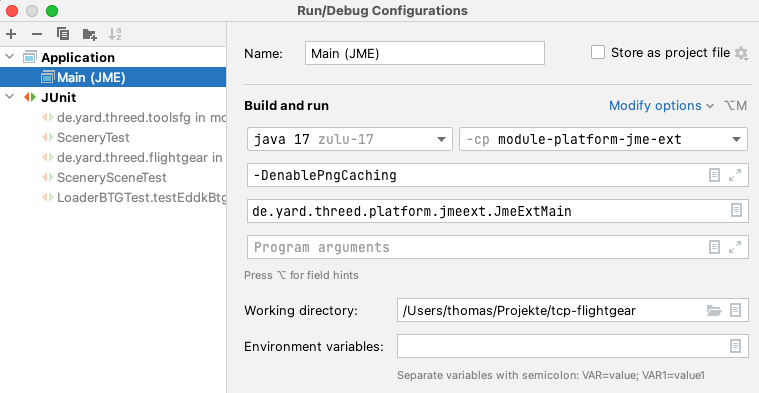

This is an extension of the cross platform 3D graphics meta engine for Java in project
https://github.com/thomass171/tcp-22 with components of flightgear. Flightgear (https://www.flightgear.org) is a free
open source flight simulator written in C++ and using OSG under GPL.

Main objective is to have Flightgear scenery and aircraft models 
available in traveling scenes running in a browser (including VR).

Also this is still WiP! See also the [examples](https://thomass171.github.io/tcp-flightgear/tcp-flightgear.html) and
my [Blog](https://thomass171.github.io/blog).

# Building And Deploying

This shows the build and installation to a web browser running locally serving from
directory $HOME/Sites. Set shell variable HOSTDIRFG (analog to HOSTDIR in tcp-22), eg.:

```
git clone https://github.com/thomass171/tcp-flightgear.git 
export HOSTDIRFG=$HOME/Sites/tcp-flightgear
```
and create that base directory. Build and install tcp-22 to your local maven repos. The build
artifacts are needed here. 

Run the following steps either manually or use the script bin/buildAndDeploy.sh for running all.

Maven is needed for building. And bundles are needed for unit testing.
So the first build is without testing for having tools available. Run

```
mvn clean install -DskipTests=true

sh bin/deployBundles.sh
sh bin/mkTerraSyncBundle.sh    

mvn install
sh bin/deploy.sh
```

for building.

Bundles 'engine' and 'data' need to be deployed (copied) manually currently to avoid the need of ADDITIONALBUNDLE.

# Running
## Browser
Enter the URL
```
http://localhost/<youruserdir>/tcp-flightgear/tcp-flightgear.html?host=http://localhost/<youruserdir>/tcp-flightgear
```
in your browser.

# Development
The most convenient way is to develop for a Java platform like JME (or homebrew) initially and later test it on other platforms
like ThreeJs and Unity. Thats because the other platforms need converting which reduces
roundtrip time.

In your IDE you might create a launch configuration like the following.



For running Java 3D software native libraries like 'lwjgl' are required.
These are typically located in the current working directory or via LD_LIBRARY_PATH.

# Technical Details
## Modules 
### flightgear
Migration of some components of FlightGear to Java:

  * simgear property tree including SGExpressions
  * Scenery loader
  * Model loader
  * Aircraft/Vehicle loader 'FgVehicleLoader'

Flightgear should be a kind of plugin to module 'traffic'.

Design of migration is:
  * Replace OSG by ...
  * Move global property trees to ...
  * TODO: BTG model loading is part of tools, so only available for converting aso.

TODO: extract a core module without engine dependency to have tools-fg without engine dependency.

#### FG animations
Animations are a key feature in flightgear for having effects.

For example Models/Power/windturbine.xml has a 'Rotate' animation
```
<type>rotate</type>
  <object-name>Generator</object-name>
  <object-name>Shaft</object-name>
  <object-name>Hub</object-name>
  <object-name>Blade1</object-name>
  <object-name>Blade2</object-name>
  <object-name>Blade3</object-name>
  <property>/environment/wind-from-heading-deg</property>
...
```
that rotates the six listed objects by wind heading and a 'Spin' animation
```
<type>spin</type>
  <object-name>Shaft</object-name>
  <object-name>Hub</object-name>
  <object-name>Blade1</object-name>
  <object-name>Blade2</object-name>
  <object-name>Blade3</object-name>
...
  <property>/environment/wind-speed-kt</property>
...  
```
that lets spin the listed objects (five of these are already used in first animation) according to wind speed.

After applying all animations the node graph in FG looks like (wind 270° at 3 kt)

```
-windturbine.ac
 +-rotate animation (angle=-360.002, axis=[ 0, 0, 1 ])
   +-spin rotate animation
     +-Blade1
   
```

The typical scene node tree layout of a XML loaded model before applying animations is

```
-xmlResource
 +-ACPolicy(2)
   +-GLTF(2)
     +-ac-world
       +-Generator
       +-Shaft
...
```

After applying animations it is (30.11.24 really? no rotate missing?)

```
-xmlResource
 +-ACPolicy(2)
   +-GLTF(2)
     +-ac-world
       +-Generator
       +-Shaft
...
```


Like for effects it's really hard to comprehend how FG implements animations. Only the base idea
(from https://wiki.flightgear.org/Howto:Animate_models) appears  
clear.
One important issue in rotate animations is the 3D way to always rotate an object around its center. FG however
provides an option to define a center for rotation. For doing this a sequence of three 3D operations is needed:
"move center","rotate","move center back" (we call it the MCRMCB pattern). FG can apply these operations
in one step to the model matrix in class SGRotateTransform, but we have no access to the final matrix. So
we embed one single FG "rotate group" into a "move center" and a "move center back" node. 

The windsock model uses cascade rotations. According to logging the final node tree for windsock_lit in FG is

```
-windsock_lit.ac
 +-rotate animation()
   +-windsock
     +-scale animation
       +-translate animation
         +-rotate animation142(angle=30, axis=[ -1, 0, 0 ])
           +-5kt
           +-rotate animation()
             +-rotate animation
               +-rotate animation
                 +-15kt
                   +-??
                 
```
Apparently each time an object is mentioned in an "animation" tag (in this cae '15kt'), a new 
animation node is inserted between the object and the current parent,
resulting in the above order (scale, translate, 4xrotate). But where did the 5th go? Maybe a FG logging problem.
An additional issue with the windsock model are windsock specific properties like '/environment/windsock/wind-speed-12.5kt'. It
appears the windsock model is a kind of hack.

So we try to implement the idea hopefully meeting what FG meets.

In the [scene object tree](#scene-object-tree) special nodes (eg. SGRotateAnimation, which is also used for 'spin'
animations) are created for each animation. To these nodes
the changes of values are supplied as needed during runtime. The objects listed
in the animation definition are attached to the animation nodes accordingly.


For updating the animations FG uses OSG NodeCallbacks (eg. UpdateCallback) that hook into OSG and are executed while rendering the
scene graph.

Currently the following animations are migrated:
  * PickAnimation
  * RotateAnimation, eg. windturbine, needle in ASI

For animated scenery objects ECS entities containing a FgAnimationComponent will be
created while for vehicle animations in sub models all FgAnimationComponents
are collected in the vehicle entity.

### tools-fg

### traffic-fg
Extension of base module 'traffic' with components of flightgear. These components
should implement generic 'traffic' interfaces with Flightgear logic.

### traffic-advanced
Use cases that use the traffic implementations of 'traffic-fg'. The setup including unit
tests also uses externally hosted bundles.

### platform-jme-ext
Extension of platform-jme as a helper for faster dev cycles. In principle
everything in project "tcp-flightgear" should be usable as plugin in "tcp-22".

### platform-webgl-ext
Extension of platform-webgl.

# Credits

Wayne Bragg (and others) for c172p (TODO link).

Syd Adams, Justin Smithies for the 777 (TODO link).

Stewart Andreason (http://seahorseCorral.org/flightgear_aircraft.html) for 'bluebird'

# Flightgear data
Flightgear needs data for
  * scenery
  * scenery material
  * aircraft model
  * aircraft commons
  * ground nets

See also 'fg-raw-data/Readme.md' about data. 

## Scenery data
Flightgear scenery data is stored by 'TerraySync' in a directory tree with three sub dirs

  * 'Terrain'
  * 'Objects': Tiles like 'Terrain'. Contains tile specific model
  * 'Models': Shared model (like wind turbine)


This project contains a subset of FG tiles around EDDK for unit testing and illustrating.
The full set is available via a proxy server...

Bundle building for scenery differs from other bundles (mkTerraSyncBundle.sh). The original TerraSync
directory structure is retained and just directory files are added in the root of the tree.
So the bundles are a kind of overlay on the TerraSync structure.

The bundle for 'Models' with a dir file 'directory-model.txt' isn't used currently. And
it might be too large.

btg-files are converted to gltf files during bundle building. Even though converted to gltf, the bundle directory will still list the filename with
suffix 'btg'.

## Terrain(btg) conversion
The btg files contain a terrain mesh with a land class assigned to each
mesh element (triangle?). During rendering the land class is mapped
to a material (texture/effect) depending on the region and season.
So far so good. The idea of material definition however isn't that clear.
Probably a material/landclass name should be unique per region and season, but
probably it isn't. At least not reliable.

Since we convert the btg files to gltf in an external process (mkTerraSyncBundle.sh), we cannot consider seasons efficiently. We
could consider region, but currently don't do so. We
just use Europe/Summer.

By default, the BTG to GLTF conversion uses SGMaterialLib and picks just one
Europe/Summer texture for adding a simple texture material to the GLTF material
list. This results in a valid GLTF file that can be viewed with any GLTF viewer.
As of 11/2024 land classes are retained as material name. So during terrain building,
the FG region/season mapping can still be used.

As of 11/2024 BTG to GLTF conversion will always run with SGMaterialLib so there will
be no longer GLTF containing no material list. 

There are some materials (land classes) like

  * pc_helipad
  * SoneSort
  * pa_helipad
  * Crop
  * Shrub

that might be defined nowhere. This needs further investigation.

## Aircraft Model
This project contains the aircraft model 'bluebird' for unit testing and illustrating.

The bundle fgdatabasic (build from fg-raw-data) is a subset of the $FGROOT/Aircraft directory.

More advanced aircraft model are used in module traffic-advanced. These are loaded from an external server, which is a temporary solution
until there is a full FG proxy set up.

# Implementation Details

## Model
The preferred model format in Flightgear is 'ac'. This is human readable for the
price of high system load at runtime. For saving resources, ac-files are converted
to gltf files during bundle building. Unfortunately the converter still has bugs,
eg. some special ac features like two sided faces are not yet converted
correctly.

Even though converted to gltf, the bundle directory will still list the filename with
suffix 'ac'.

FG uses XML configuration for aircraft model and has two specific ways of component lookup:
* Some aircraft reference components in some global directory ($FG_ROOT/aircraft(?) in FG).
* Some aircraft reference components in their own directory/bundle by using a prefix "Aircraft", that isn't part of any path.

The AircraftResourceProvider helps finding these components independent from a specific installation directory and bundle.
Eg. 'bluebirds' 'YOKE' references 'Aircraft/bluebird/Instruments-3d/yoke/yoke.xml', which
could be found in either FG_ROOT/Aircraft or in bluebirds own directory
with prefix 'Aircraft' removed.
A 'Aircraft/Instruments-3d/yoke/yoke.ac' path however points to FG_ROOT.

## Scene Object Tree

The scene object tree of FG is retained as far as possible. ...

FG uses proxy nodes for model that are not loaded before the viewer steps onto that
node (see SGModelLib).

## Effects
See also https://wiki.flightgear.org/Effect_framework.

In FG effects (eg. transparency) are defined in XML and applied at runtime 
via an OSG node visitor (MakeEffectVisitor). When the visitor is reached the current OSG
and/or OpenGL state is available via the super class osg::StateSet of class Pass and 
provides the resources (eg. textures, buffer, uvs, shader) where effects should apply. Maybe
this is done immediately before the draw command. It's unclear whether and how
resources like textures and shader are shared.

An important step of migration is replacing OSG classes StateSet and Material with
our classes Texture and Material. Instead of having a (global) current state we provide
the material where effects should apply via material wrapper as super class of class Pass.
So an effect will be connected to a specific material after realizeTechniques(). For texture
sharing will still have the simple cache from tcp22.

The effect property '<inherits-from>' probably just means 'copy property tree from parent'. The
parent itself is never realized.

We ignore schemes and compositor for now.

Later versions (2024) of Flightgear apparently no longer prefer using
'<inherits-from>Effects/model-transparent</inherits-from>' for
effects? At least beacon.xml no longer uses it. So this is no good use/test case for
understanding how it works. Maybe it never worked as intended in beacon? "model-transparent.eff" appears
no longer popular at all. But c172p propeller and scenery models still use it.
beacon.xml in fg-raw-data replaced with latest version, but we keep the pre2024 version for testing.

The property tree layout for effects looks like

```
...
-parameters
 +-texture
   +-image
...
```

For terrain effects the material definitions are converted to the above layout
in SGMaterial.buildEffectProperties(). Eg. global-summer.xml defines "<texture>Terrain/dry_pasture4.png</texture>" in a material.
